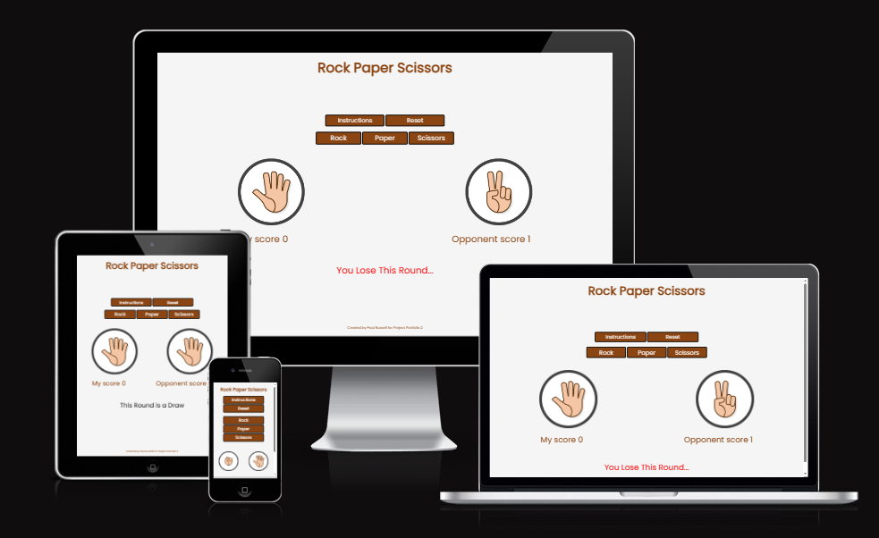
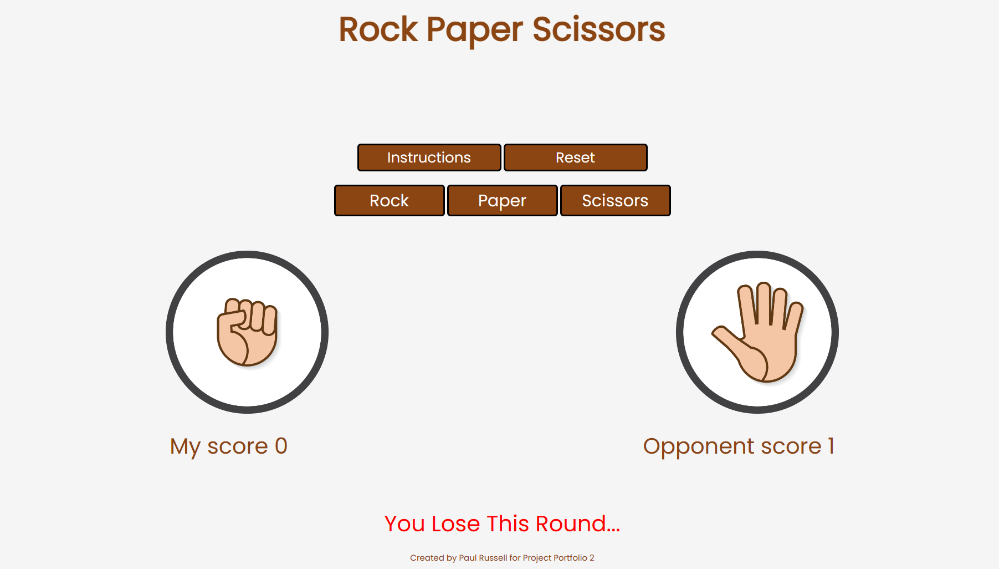
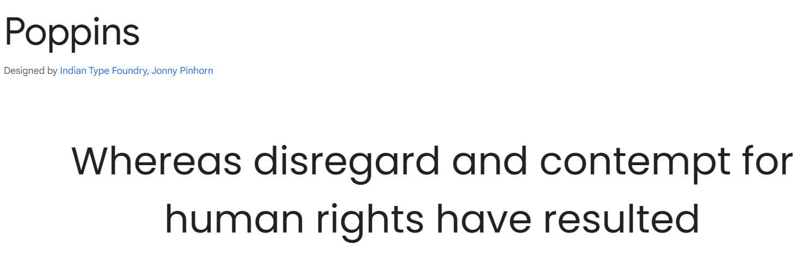
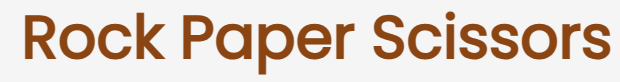
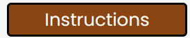
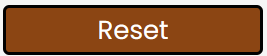
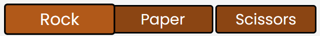

# Rock Paper Scissors

This is a website for my Rock Paper Scissors game. The user competes against the computer at a classic game of rock paper scissors. The aim of the game is for the user to get to 5 points before the computer to win.

The aim of this project is to develop a front-end website, where the website is able to repsond to the users actions and altering the way the website displays information, and ultimately for the user to enjoy playing a game.

Link to the game: <https://paulr1209.github.io/rock-paper-scissors-game/>

## UX & Design

I wanted to go for a simple design, so the game displayed clearly on the web page, and the user would not be distracted from the game.

### User Stories

As a user, I first, want a clear and simple design, that is not going to distract me from the game.
I want the title of the game to be at the top of the page so it is clear what I am playing.
I want to be able to open and close the instructions without interfering with the game.
I want to be able to reset the game at any point. 
When I choose between rock, paper or scissors, I want to be able to see the opponents choice, and I want to clearly see the result of each round.
I want to be able to see the current score of the game.
I want clearly labelled buttons.
I want the game to indicate at the end, whether I won or lost, and I want to be able to see the final round results.

### Color Scheme

I did not follow a particular color scheme. I first picked the images that I was going to use to display results, and I then settled with a whitesmoke background, with saddlebrown font. I thought these two colors complimented the result images. With the buttons, I went for a saddleback background with a white font to go with the overall design.

### Typography

I used Google Fonts to import Poppins style for all of my text.

## Features

### Heading

The heading appears at the top of the page and shows the name of the game

### Instructions Button and Modal Box

I used an Instructions button, which when clicked on, opens a modal box with all the instructions in. I used a modal box to keep the web page clean and simple. It can be opened and closed when the user needs it or is finished with it, and it does not interfere with the game.

### Reset Button

I included a reset button, so that the user can reset the game at whatever point they chose. This keep the user in full control of the game. This resets the score back to 0-0.

### Rock Paper Scissors Buttons

These buttons are for the user to choose. This causes the opponent to choose as well. As you can see on the image below, the reset button is slightly bigger, and lighter in color. This happens when the user hovers over the button with their mouse. 

