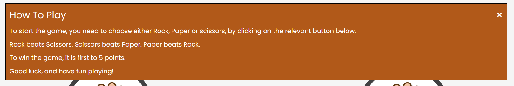

# Rock Paper Scissors

This is a website for my Rock Paper Scissors game. The user competes against the computer at a classic game of rock paper scissors. The aim of the game is for the user to get to 5 points before the computer to win.

The aim of this project is to develop a front-end website, where the website is able to repsond to the users actions and altering the way the website displays information, and ultimately for the user to enjoy playing a game.

Link to the game: <https://paulr1209.github.io/rock-paper-scissors-game/>

## UX & Design

I wanted to go for a simple design, so the game displayed clearly on the web page, and the user would not be distracted from the game.

### User Stories

* As a user, I first, want a clear and simple design, that is not going to distract me from the game.
* I want the title of the game to be at the top of the page so it is clear what I am playing.
* I want to be able to open and close the instructions without interfering with the game.
* I want to be able to reset the game at any point. 
* When I choose between rock, paper or scissors, I want to be able to see the opponents choice, and I want to clearly see the result of each round.
* I want to be able to see the current score of the game.
* I want clearly labelled buttons.
* I want the game to indicate at the end, whether I won or lost, and I want to be able to see the final round results.

### Color Scheme

I did not follow a particular color scheme. I first picked the images that I was going to use to display results, and I then settled with a whitesmoke background, with saddlebrown font. I thought these two colors complimented the result images. With the buttons, I went for a saddleback background with a white font to go with the overall design.

### Typography

I used Google Fonts to import Poppins style for all of my text.

## Features

### Heading

The heading appears at the top of the page and shows the name of the game

### Instructions Button and Modal Box

I used an Instructions button, which when clicked on, opens a modal box with all the instructions in. I used a modal box to keep the web page clean and simple. It can be opened and closed when the user needs it or is finished with it, and it does not interfere with the game.

### Reset Button

I included a reset button, so that the user can reset the game at whatever point they chose. This keep the user in full control of the game. This resets the score back to 0-0.

### Rock Paper Scissors Buttons

These buttons are for the user to choose. This causes the opponent to choose as well. As you can see on the image below, the rock button is slightly bigger, and lighter in color. This happens when the user hovers over the button with their mouse. 

### Result Images

These images represent the user and computer choices. There are three possible images that appear. Either rock, paper or scissors. This shows the user what choice the computer made, and therefore is able to compare visually the result.

### Scores

I have added scores underneath the result images, so that the user can check follow the score, whether they are winning or losing.

### Text Feedback

I added some text feedback under the score to give an extra indicator of what was happening each round. It allows the user to follow the game easier. I have styled the 'You Lost this round' text, to the color red, and the 'You win this round' text, to the color green.

### Features I Would Like To Add

#### Animation

I would like to add some animation to the result images and text feedback after each round, to show the round has been played. I would also like to add a shade of green for the round winner, and a shade of red for the round loser on the image. I would also like to add animation to the score when one of the players score changes. 

#### Alerts

I would like to remove the two alerts at the end of the game, and display a message on the web page instead.

# Testing

## HTML Validator

## CSS Validator

## Javascript Validator

## Lighthouse

## Manual Testing

I tested my website out on a Lenovo IdeaPad Flex 5 laptop, and a Google Pixel 8.

I also have a second monitor which is the size of a small computer screen. I had a few issues with my responsive design. On my second monitor, I had way too much blank space not being used, so through testing, I was able to reposition the contents and make it look much better. Everything else worked fine.

# Bugs

When the alert pops up to say whether you win or lose, the game resets before seeing the final result. The score does not load when you hit 5 points. I have put a temporary fix in place, while i figure out the issue. I have put a 'game over' alert, that pops up after the first alert, and I have set the game to reset after clicking out of this alert, to allow the final results to load. 

# Deployment

This site was deployed by GitHub pages. Here is the link to my repository: <https://github.com/PaulR1209/rock-paper-scissors-game>

* In the repository, go to settings.
* Then go to pages.
* Make sure the branch is set to main and the folder is set to root.
* Then click deploy from a branch.

# Credits

## Code

I look inspiration from W3Schools, the Love Maths project, and also this tutorial: https://sebhastian.com/rock-paper-scissors-javascript/ Apart from what is credited below, everything else was created and written by me.

### Modal Box

I used code to create my modal box from this W3Schools tutorial: https://www.w3schools.com/howto/howto_css_modals.asp 

### Check Winner and Change Result Image Functions

I used code from this tutorial to help create the check winner and Change Result Image function: https://sebhastian.com/rock-paper-scissors-javascript/

### Images

I found the rock paper, scissors images on Google Images.